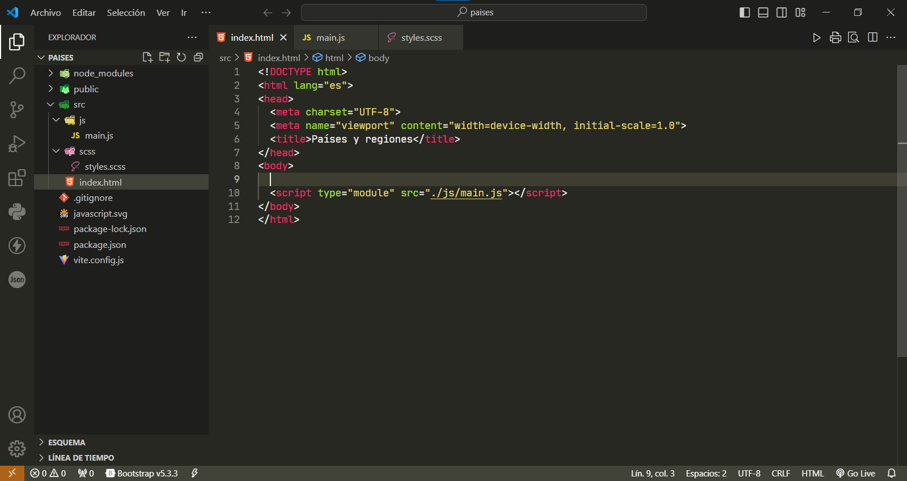

# Países y regiones

Un nuevo proyecto de ViteJS.

## Empezando

Este proyecto es un punto de partida para una aplicación Web Frontend.

## Vista previa del código - Elaborar una aplicación web de Países y regiones

